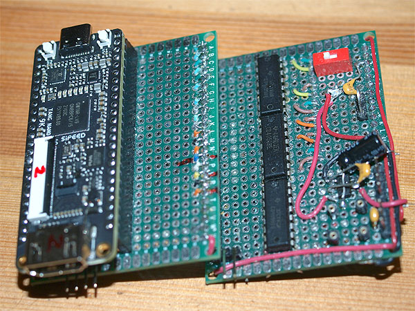
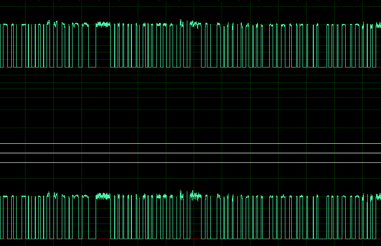

# MT32-DIT
<h3>Adding digital output to legendary Roland MT-32</h3>

Project status: ⬛⬛⬛⬛⬛⬛⬛⬛⬛⬛⬛⬛⬜ 95%

This project can be considered part #2 of the digitalization of old synthesizers. In the first part I described <a href="https://github.com/vetal-esher/18bit-DIT">how you can add a  digital outpu</a>t to almost any synthesizer (where the DAC circuit uses standard L/R combined I2S) by using the AK4103AVF

Roland MT-32, familiar to old gamers in the 90s and very rare now, is an even older device that uses a parallel DAC scheme that was 
quite common in Roland's D-series, which does not just convert the final stereo stream in-line, but also simultaneously performs 
the services of a DAC for the reverb IC.

<h3>Digging demuxer logic</h4>

It turns out that we do not have direct access to the digital stream containing the final audio data. The PCM54HP receives a stream 
that sequentially contains not only clean left and right channels, but also separate reverb data for the left and right channels. 
It looks something like this (all frames are 16bit, order is assumed): [RSYN1][LSYN1][REV R][REV L][RSYN2][LSYN2][RSYN1][LSYN1][REV R][REV L][RSYN2] [LSYN2] etc.

The advantage of a parallel DAC is that it works instantly, i.e. there is no delay at all in taking the current values 
from the (essentially) resistor assembly and the next moment doing the task of transforming a completely different picture. <strong>Edit: 
to tell the truth, there IS small delay required to let the output settled the final value.</strong>

The widely known CD4051 is engaged in demultiplexing all this porridge of audio data. Channel switching in the CD4051 is carried out 
through the control lines mixed from LA and Reverb chips SH1 SH2 SH2 (SH - Sample / Hold), as well as the INH line, which turns on and off 
all channels. At the output of the demuxer, three pairs of analog channels are formed, which are then mixed and undergo final 
processing in a low-pass filter. The LP filter should have a flat amplitude response in the 0-20kHz range and a high attenuation above 20kHz.

Bit depth and sampling frequency of MT-32 according to the declared characteristics - 15bit 32kHz. In the first version of MT-32 
(the so-called "old"), the last (actually, LSB) 16th bit at the PCM54HP input is shorted to ground, and for that (15bit) reason the 14th bit fell out 
in the data bus itself (counting from zero). However, for us, the frame width will always be 16 bits (the 2nd MT-32 version has full 16bit bus). Theoretically, the channel  switching frequency 0-1-2-3-4-5-6-7 each time triggers a 0/1 state change in control signal A, so you can 
expect 128kHz on this line,  64kHz on line B, and C with 32kHz respectively. But we don't know the order of the frames. Even if we 
sequentially record all the states of the parallel bus, it will be useless if we do not know the order of switching ABC. In practice, 
without a three-channel oscilloscope, you can try to catch the states of at least two of the three lines (A and C), and then record 
the AB and BC, A and INH sequences in order to further bring the picture into one.

So now we know the frame order: [L REV][RSYN2][LSYN2][R REV][RSYN1][LSYN1], [L REV][RSYN2][LSYN2][R REV][RSYN1][LSYN1] .. etc. 
If you listen to these pins in analog, it becomes clear that SYN1 is a clean signal, REV is a reverb return. SYN2 appears to be 
analog as well, but too quiet to be recorded legibly; but since SYN2 is also mixed into the final mix, we'll do that too. 
By the way, if you look at the unused outputs of the CD4051 CH4 and CH5, there will be [almost] crisp 32kHz:

The INH control signal operates at a frequency of 256kHz, which means we will need to read all ports at this frequency. 
Disabling all channels is necessary so that there is no false triggering on rising edges @ABC states, when INH=1 tells us that 
we don’t need to send anything to serial. With INH=0, we must read the bus, and depending on the states of ABC, scatter it to 
the appropriate output. Ideally, we need to define the beginning of frame (we take the highest INH peak for the reference frame)
and mix all L / R frames into two final ones. But for the test, you can start by sending two frames with a clean non-reverberated 
information (RSYN1, LSYN1). At first I thought to bother with the sequence' start detection, but then I omitted this part, because,
even if the logic begins to run in the middle, defining LSYN1 as the end of the sequence we will reset the counters and then start 
working in the correct order. The logic in this case will look something like this (I will use a pseudo-language here with a syntax 
that is clear to everyone):

<pre>
(R,L)=(0,0);
(FLAG_RSYN1,FLAG_LSYN1,FLAG_RSYN2,FLAG_LSYN2,FLAG_RREV,FLAG_LREV)=(0,0,0,0,0,0);
(RSYN1,LSYN1,RSYN2,LSYN2,RREV,LREV)=(0,0,0,0,0,0);
while (256kHz_cycle) {
	input=read(PCM54_parallel);
	A=read(CD4051_A); B=read(CD4051_B); C=read(CD4051_C); INH=read(CD4051_INH);

	#INH==0 enables output
	if (INH==0) {
		if (A==1 && B==1 && C==0) {
			RSYN2=input; FLAG_RSYN2=1; #RSYN2
		}
		elsif (A==0 && B==1 && C==0) {
			LSYN2=input; FLAG_LSYN2=1; #LSYN2
		}
		elsif (A==0 && B==0 && C==1) {
			RREV=input; FLAG_RREV=1;   #RREV
		}
		elsif (A==0 && B==0 && C==0) {
			LREV=input; FLAG_LREV=1;   #LREV
		}
		elsif (A==1 && B==1 && C==1) {
			RSYN1=input; FLAG_RSYN1=1; #RSYN1
		}
		elsif (A==0 && B==1 && C==1) {
			LSYN1=input; 		   #LSYN1 this is the last channel in frame
			(FLAG_RSYN1,FLAG_LSYN1,FLAG_RSYN2,FLAG_LSYN2,FLAG_RREV,FLAG_LREV)=(1,1,1,1,1,1);
		}

		if (FLAG_RSYN1==1 && FLAG_LSYN1==1 && FLAG_RSYN2==1 && FLAG_LSYN2==1 && FLAG_RREV==1 && FLAG_LREV==1) {

			#in merge there will be magic
			L=merge(LSYN1,LSYN2,LREV);
			R=merge(RSYN1,RSYN2,RREV);
			write_serial(R,L); 

			#reset channel flags
			(FLAG_RSYN1,FLAG_LSYN1,FLAG_RSYN2,FLAG_LSYN2,FLAG_RREV,FLAG_LREV)=(0,0,0,0,0,0);
		}
	}
}
</pre>

<h3>Hardware part</h3>

Schematically, the plan of the entire project was drawn like this:

There is only one magic figure involved in this plan, and here, I will honestly say, giant constructions of logic which must perform the task of mixing digital streams comes to mind. I was told that I should stop doing garbage and learn a programmable FPGA. All of the DAC and INH/A/B/C signals are CMOS-level, so we need to convert them to TTL by CD4050B. By the way, we will get fixed levels of INH after CD4050:

<h4>DIT</h4>

Since we are dealing with 16 bits, a large number of DITs can be used, as they all work at least with 16-bit RJ. For these purposes, I chose DIT4192, because I have it  already available after experimenting with the 18-bit DIT, but you can skip mounting 4192 if you don't have it (details below). Settings are typical:
<table border="1">
<tr><th colspan="2">DIT4192 Hardware mode</th></tr>
<tr><td>Mode operation</td><td>Slave (SYNC and SCLK are inputs)</td></tr>
<tr><td>Format</td><td>16-Bit Right-Justified</td></tr>
<tr><td>Sampling frequency</td><td>32kHz</td></tr>
<tr><td>Master clock</td><td>16.384MHz (512*fs)</td></tr>
<tr><td>Bit clock</td><td>1.024MHz (16*2*32KHz)</td></tr>
</table>

<h3>Magic part</h3>

The FPGA <a href="https://wiki.sipeed.com/hardware/en/tang/Tang-Nano-9K/Nano-9K.html">TangNano9K</a> was chosen for the magic part, so the "profit" plan was drawn:

And then the complete schematic of the "magic" part was done. Note the I2S connector, you can completely skip DIT4192 in schematic and use your favorite external DIT, or even just transport I2S to I2S receiver. I tested I2S with external WM8804 DIT board and it works perfectly.

<h3>Making prototypes</h3>

I started with sandwich-like breadboard, trying to split the CMOS-TTL logic from TangNano. Different methods, using couple of variants (voltage dividers) and CD4050 were tried..

.. and then, when i finally decided to use CD4050, i have projected the PCB. The PCBs were made quick at PCBway factory, and i must say their quality is awesome, even for such pet projects like mine :) 

Final design assumes, that the original PCM54HP will be desoldered from MT-32 mainboard, and then socketed on second footprint right on DIT pcb. After that, MT32-DIT can be soldered or socketed on MT-32 mainboard. But for now, we'll just put on the DIT board right over PCM54HP IC.

<h2>Partlist</h2>
<table border=1>
	<tr><th>Reference</th><th>Total</th><th>Value</th><th>Package</th></tr>
	<tr><td>X1</td><td>1</td><td>16.384MHz</td><td>Oscillator DIP-8</td></tr>
	<tr><td>U1, U2, U3, U5</td><td>4</td><td>CD4050</td><td>SO-16</td></tr>
	<tr><td>U4</td><td>1</td><td>Gowin 9K</td><td></td></tr>
	<tr><td>U6</td><td>1</td><td>PCM54HP**</td><td>DIP-28</td></tr>
	<tr><td>U8</td><td>1</td><td>DIT4192IPW***</td><td>SSOP-28</td></tr>
	<tr><td>U7</td><td>1</td><td>AP1117-33</td><td>SOT223-3_TABPIN2</td></tr>
	<tr><td>U10</td><td>2</td><td>PinHeader 1x28</td><td>P2.54mm</td></tr>
	<tr><td>T1</td><td>1</td><td>PE-65612NL***</td><td>PE-65612NL</td></tr>
	<tr><td>SW1</td><td>1</td><td>PWR SW</td><td>SW_DIP_SPSTx01_P2.54mm</td></tr>
	<tr><td>SW2</td><td>1</td><td>CFG SW***</td><td>SW_DIP_SPSTx05_P2.54mm</td></tr>
	<tr><td>R1, R2, R4, R5, R6, R7, R8</td><td>7</td><td>10K ***</td><td>0402</td></tr>
	<tr><td>R3</td><td>1</td><td>300R ***</td><td>0402</td></tr>
	<tr><td>J1</td><td>1</td><td>PinHeader 1x04</td><td>P2.54mm</td></tr>
	<tr><td>J2, J3***</td><td>2</td><td>PinHeader 1x02</td><td>P2.54mm</td></tr>
	<tr><td>J4</td><td></td><td>DNP*</td><td></td></tr>
	<tr><td>J5</td><td>1</td><td>PinHeader 1x05</td><td>P2.54mm</td></tr>
	<tr><td>C1, C2, C3, C4, C5, C6, C7, C8, C10, C11, C12***, C13***, C14</td><td>13</td><td>0.1uF</td><td>0402</td></tr>
	<tr><td>C15***</td><td>1</td><td>10uF</td><td>0402</td></tr>
	<tr><td>C9</td><td>1</td><td>10-22uF</td><td>CP_EIA-7343-43</td></tr>
</table>

If only specific component can be skipped, it's marked within "Reference" column, otherwise all components can be skipped if mark is in "Value" column.

<strong>*</strong> - Do Not Place

<strong>**</strong> - optional, no need if DIT pcb soldered on top of the original DAC

<strong>***</strong> - optional, no need if DIT4192 is not available and you use external DIT

<h3>Learning VERILOG</h3>

I did not have any experience in designing FPGA projects, and did not knew about verilog language anything. But it appeared, that my pseudo-language logic described above is almost verilog-like! So, after few weeks, the very first working code was written.

  
First verilog code:
	

<pre>
module top (
        input mclk,             //master clock //pin 51
        input clk_inh,          //256kHz INH clk input //pin 53
        input [2:0] ch_id,      //cd4051 sample/hold controls a/b/c 128/64/32kHz //pin a 77 b 76 c 48
        input [15:0] dac,       //parallel input from dac
	input sys_rst_n,        //reset input
	output wire dtr,        //data ready flag //pin54
        output sdata,           //16bit i2s sdata output  //pin 49
        output wire wclk,       //i2s word select lrck output 32kHz //pin 31
        output wire bck         //i2s bit clock output 1024MHz //pin32
);

wire [31:0] data;

dac_decoder dac1(
	.clk_inh(clk_inh),.ch_id(ch_id),.dac(dac),.data(data),.rst_n(sys_rst_n),.dtr(dtr)
);

i2s_serializer ser1 (
	.mclk(mclk),.sdata(sdata),.wclk(wclk),.bck(bck),.data(data),.rst_n(sys_rst_n)
);

endmodule

module i2s_serializer (
        input mclk,             	//master clock 16.384MHz
	input [31:0] data,		//input channels register 
	input wire rst_n,		//reset button	
	output reg sdata,   	    	//i2s sdata output
        output reg wclk,        	//i2s word select lrck output mclk/512 = 32kHz
        output wire bck         	//[3] bit'mclk. i2s bit clock output 
					//16bit * 2 * 32000 = 1.024 MHz (16.384/16)
);
reg [31:0] mclk_counter;       		//32bit counter
assign bck=mclk_counter[3];     	//1.024MHz divide
reg [31:0] data_buf;			//i2s output buffer 
reg [4:0] cbit;				//0-15 current bit counter
			
initial begin
	mclk_counter<=0; cbit<=0; wclk<=0; data_buf<=0;
end

always  @(posedge mclk,negedge rst_n) begin
	if(!rst_n) begin mclk_counter<=0; end 
	else begin mclk_counter<=mclk_counter+1; end
end

//i2s WCLK=0 left, =1 right
always  @(negedge bck) begin					//send sdata from buffer
	if (wclk==0) begin sdata<=data_buf[31-cbit]; end 	//LSYN send
	else if (wclk==1) begin sdata<=data_buf[15-cbit]; end	//RSYN send
	cbit<=cbit+4'b01;
	if (cbit==15 && wclk==0) 
		begin cbit<=0; wclk<=1; end			//LSYN1 end
	else if (cbit==15 && wclk==1) 
		begin cbit<=0; wclk<=0; data_buf<=data; end 	//RSYN1 end, new buffer read
end
endmodule

module dac_decoder (
	input wire rst_n,
        input clk_inh,          	//256kHz INH clk input
        input [2:0] ch_id,    		//cd4051 sample/hold controls a/b/c
        input [15:0] dac,       	//parallel input from dac
	output reg [31:0] data,		//32 bit
	output reg dtr			//data ready flag
);
reg [15:0] ch0;				//LREV
reg [15:0] ch6;				//RSYN2
reg [15:0] ch2;				//LSYN2
reg [15:0] ch1;				//RREV
reg [15:0] ch7;				//RSYN1
reg [15:0] ch3;				//LSYN1
initial begin
	ch0<=0; ch1<=0; ch2<=0; ch3<=0; ch6<=0; ch7<=0; dtr<=0; data<=0;
end

always  @(negedge clk_inh,negedge rst_n) begin
	if(!rst_n) begin
		dtr<=0; data<=0;
	end 
	else begin
	case (ch_id)
		4 : begin dtr<=0; end 			// empty
		0 : begin dtr<=0; ch0<=dac; end 	// LREV
		6 : begin dtr<=0; ch6<=dac; end 	// RSYN2 
		2 : begin dtr<=0; ch2<=dac; end 	// LSYN2
		5 : begin dtr<=0; end 			// empty
		1 : begin dtr<=0; ch1<=dac; end 	// RREV
		7 : begin dtr<=0; ch7<=dac; end 	// RSYN
		3 : begin dtr<=1; ch3<=dac; data = {dac,ch7}; end // LSYN
	endcase
	end
end
endmodule
</pre>

The <a href="https://www.youtube.com/watch?v=VIkrG32c1l0">first video</a> of clean capture (sorry for low volume, it was at night) (clean stereo, no reverb).

<h3>Mixing 6 digital channels to stereo pair</h3>

The simplest logic of audio mixing is summing the levels. This works in digital too. Remember, that actual bitwidth of "old" Roland MT-32 is 15 (LSB bit is tied to the GND. So, 
we can use 17-bit buffer to sum all 3 channels. Also i implemented "reverb on/off" switch tied to second button at TangNano9K devboard (first one is RESET button). 
OFFSET parameter used to avoid digital overflow problem when summing all channels.

<pre>
reg signed [15:0] lsyn1, lsyn2, rsyn1, rsyn2, rrev;	//channels from LA32 and Reverb ICs
reg signed [15:0] left,right;
reg signed [16:0] l,r;

initial begin
    data<=0; rrev<=0; rsyn1<=0; lsyn2<=0; rsyn2<=0; 
    l<=0; r<=0; left<=0; right<=0; dtr<=0;
end

localparam signed [15:0] OFFSET = 16'd8192; //Digital DC offset fix

always  @(negedge clk_inh) begin
	if (!rst_n) begin
		data<=0; dtr<=0;
	end else begin
	case (ch_id)
     		7 : begin // RSYN1
			rsyn1<=dac; dtr<=1;
			left <= l[15:0]-OFFSET; right <= r[15:0]-OFFSET;
		    end 
		6 : begin rsyn2<=dac; dtr<=0; end // RSYN2
		5 : begin data<={left,right}; dtr<=0; end // empty
		4 : begin dtr<=1; end // empty
		3 : begin lsyn1<=dac; dtr<=1; end // LSYN1
		2 : begin lsyn2<=dac; dtr<=1; end // LSYN2
		1 : begin rrev<=dac;  dtr<=1; end // RREV
		0 : begin dtr<=0; // LREV
			if (!rev_sw) begin  l<=lsyn1; r<=rsyn1;  end else 
			begin l<=lsyn1+lsyn2+dac; r<=rsyn1+rsyn2+rrev; end
 	     	end 
	endcase
	end
end

</pre>

<h3>Possible problems</h3>

<h4>Clicks</h4>

At the final stage, i found that the frequency of DTR (the flag that signals about full frame cycle pass) is slightly faster than WCLK (smth about 32.0010kHz@DTR vs exact 32.0000kHz@WCLK). 
I

The first reason is that you cannot operate with registers with multiple actions in one clock tick. You need pipeline. So, mixing logic with OFFSET must be separated.

Also, within this logic, you need to avoid update output data register when it might be in "read status" at serializer. Setting values need some time to be set, so we don't update the data when it is in stage of reading.

After that, recording more than 3 hours showed that the clicks were gone, completely.

<h4>Desync</h4>

Another problem can appear, there <strong>might be</strong> desync that can produce more clicks than useful audio data. The source of problem is in unstable crystal oscillator - you need to check the DIT pcb for shorts and leakages. 

<h4>Digital DC offset</h4>

<strong>Updated 15.10.2025</strong>
 It's seems that there's nothing we can do (at least with 1st revision of MT-32) since DAC's LSB bit is tied to ground and there is 14 bit dropped in DAC schematic. When LSB bit will be used, there will be no DC offset at all. After all, i checked the PCB and found that the Bit14(=D14) used in schematic bus between LA32/Reverb/DAC - on real PCB has no route out from LA32 and Reverb chips, and the pin 27 (D14) on LA32 has no activity on oscilloscope at all.
You can slightly lower DC offset decrementing each sample value by 16344 (that the value of amplitude zero when there's no sound from MT-32), but this will give you only 6dB fix.

<h4>Post digital LPF processing</h4>

<strong>To be continued</strong>

<h2>Mounting</h2>

<strong>Bad contact problem.</strong> It was nightmare to spend hours to find the source of noisy sound. After weeks(!) of resultless tries, i found that the way i put the pcb over original DAC is not reliable at all - some pins was not connected . 

<strong><a href="audio/clean.mp3">Example of clean sound.</a></strong>

<strong>And <a href="audio/dirty_1.mp3">this is what you should hear</a> when some bits are not connected</strong>

To avoid bad contact problem, the only way is to desolder DAC and socket it on the MT32-DIT pcb. This process is very hard without proper experience. First of all, you need to replace nearby caps with lower profile equivalents. Film caps are perfectly fit this objective. Then desolder the DAC itself.

While replacing the caps, it is time to think about picking A/B/C/INH directly from CD4051 demuxer. When you solder wires directly to DIP-package pins, wires tend to break when they bend, so i decided to solder a small protoboard over CD4051 for easy access to this signals.

I used PBD (2-row) 2.54 female headers for socketing the DIT pcb in DAC place. One row, of course, needs to be removed. Why 2-row? Just because i had much more PBD headers than PBS. You can use PBS if you want. Then socket the PCM54HP on DIT pcb.

Remove the MT-32 board from the case. It's time to drill a hole and mount RCA. Find the place where you want it.

Final picture:

<h3>Links</h3>

<a href="https://github.com/vetal-esher/MT32-DIT/blob/main/hardware/datasheets/mt-32_Service_Notes_First_Edition.pdf">Roland MT-32 service notes</a>

<a href="https://github.com/vetal-esher/MT32-DIT/blob/main/hardware/datasheets/pcm54.pdf">PCM54HP datasheet</a>

<a href="https://github.com/vetal-esher/MT32-DIT/blob/main/hardware/datasheets/hd14051bp.pdf">4051 datasheet</a>

<a href="https://github.com/vetal-esher/MT32-DIT/blob/main/hardware/datasheets/cd4050b.pdf">CD4050B datasheet</a>

<a href="https://github.com/vetal-esher/MT32-DIT/blob/main/hardware/datasheets/dit4192.pdf">DIT4192 datasheet</a>

<a href="https://github.com/vetal-esher/MT32-DIT/blob/main/hardware/datasheets/I2SBUS.pdf">I2S bus specification</a>

